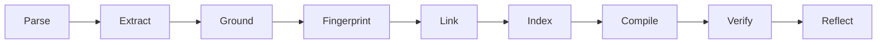

# ThinkingRoot: The Knowledge Compiler and Hybrid Retrieval Architecture

**Status:** Technical Deep Dive for Study
**Target Audience:** Core Engineering Team
**Goal:** Deliver "Pure Gold" pre-compiled context to AI Agents to eliminate hallucinations.

This document outlines the end-to-end technical architecture of ThinkingRoot. It explains how chaotic, human-readable documents (like PDFs or Code) are converted into structured, verifiable, AI-native knowledge.

---

## 1. The Core Philosophy: "The PDF for AI"

For the last 30 years, data formats (PDFs, HTML, Markdown) were optimized for **human eyes**. Standard RAG architectures force AI models to read these human formats, resulting in slow processing, high token costs, and severe hallucinations ("Lost in the Middle" syndrome).

ThinkingRoot acts as a **translation layer**. It compiles human formats into an **AI-Native Format** (Structured claims, mathematical relations, and tight provenance). 

When a standard RAG system encounters a 100-page PDF, it vectorizes 90% "noise." When ThinkingRoot compiles that same PDF, it extracts the 10% "Pure Gold"—the actual facts, discarding the boilerplate.

---

## 2. The 9-Phase Compilation Architecture (Write Path)

The compiler is a heavily optimized, Rust-based pipeline that runs sequentially. It guarantees incremental compilation so that analyzing thousands of repositories is fast.

### Phase 1: Parse (Rust)
*   **Action:** Ingests raw sources (`.md`, `.rs`, `.pdf`, Slack exports).
*   **Process:** Converts raw bytes into a normalized `DocumentIR` (Intermediate Representation). Code is parsed via `tree-sitter`.
*   **Goal:** Strip raw formatting and normalize text.

### Phase 2: Extract (Rust + Fast LLM)
*   **Action:** LLM-powered named entity recognition and fact distillation.
*   **Process:** Prompts a fast, cheap model (like Nova Micro or Claude Haiku) to pull atomic `Claims`, `Entities`, and `Relations`.
*   **Output:** The raw "Gold" is minted here.

### Phase 3: Ground
*   **Action:** Attaches strict provenance.
*   **Process:** Every extracted Claim is hard-linked to an exact `source_span` (e.g., page 42, line 15) and a `SourceID`. This makes hallucination mathematically impossible because every fact has an audit trail.

### Phase 4: Fingerprint (Incremental Caching)
*   **Action:** Prevents redundant processing.
*   **Process:** Hashes the content using `BLAKE3`. If the hash hasn't changed since the last run, the compiler halts pipeline execution for that file, saving massive amounts of compute and API cost.

### Phase 5: Link (Entity Resolution & Belief Revision)
*   **Action:** Merges facts into the global CozoDB Graph.
*   **Process:** 
    *   *Alias Merging:* Recognizes that "AWS" and "Amazon Web Services" are the same `EntityID`.
    *   *Contradiction Detection:* Flags conflicting claims and triggers the Belief Revision Engine.

### Phase 6: Index (Vector Generation)
*   **Action:** Prepares the data for Semantic Search.
*   **Process:** Runs the claims through `fastembed-rs` (entirely local, no API calls) to generate highly dense `[f32; 384]` vector embeddings.

### Phase 7: Compile (Generation)
*   **Action:** Generates human/agent hybrid artifacts.
*   **Process:** Reconstructs the graph into `knowledge.card.md` or Task Packs.

### Phase 8: Verify (Memory CI)
*   **Action:** Quality Assurance for Knowledge.
*   **Process:** Calculates the **Health Score** based on data Freshness, Consistency, Coverage, and Provenance.

### Phase 9: Reflect (Reflexive Knowledge Discovery)
*   **Action:** The graph learns what it doesn't know.
*   **Process:** Executes Datalog queries to find statistical gaps (e.g., "92% of services have authentication docs. PaymentService does not."). Generates `known_unknown` Gap Claims.

---

## 3. The Temporal and Event Calendar Engine

Knowledge is not static; it changes over time. Standard vector databases overwrite or delete old knowledge. ThinkingRoot tracks **Temporal Provenance**, maintaining a complete history of truth.

### The Temporal Properties of a Claim
Every `Claim` in the graph has four critical fields:
*   `created_at`: The exact time the document was written.
*   `valid_from`: When this fact became true.
*   `valid_until`: Option<DateTime>. When this fact stopped being true.
*   `superseded_by`: Option<ClaimId>. The new fact that replaced this one.

### The Event Calendar Workflow
When a developer pushes a new PR that changes a dependency:
1. The new document is compiled.
2. The Link phase detects a Contradiction: "Old Doc says X, New PR says Y."
3. The system compares the timestamps and source trust levels.
4. Old Claim `valid_until` is set to NOW. `superseded_by` is set to the New Claim ID.
5. **Result:** An agent can query "What dependency did we use *last year*?" and the system perfectly traverses the timeline.

---

## 4. The Hybrid Retrieval Architecture (Read Path)

When an AI Agent (via MCP) or a human queries the system, ThinkingRoot does not rely on simple vector similarity. It fuses two distinct mathematical search techniques.

### Technique A: Semantic Vector Search
*   **Tool:** LanceDB / fastembed.
*   **How it works:** Finds claims that have the closest "meaning" to the user's prompt. 
*   **Flaw:** Can return structurally irrelevant data.

### Technique B: Datalog Structural Graph Search
*   **Tool:** CozoDB.
*   **How it works:** Traverses the strict mathematical bounds of the graph. (e.g., `?[claim] := *entities{id: "React"}, *claim_entity_edges{claim_id: claim, entity_id: id}`).
*   **Flaw:** Fails if the user uses slightly different vocabulary.

### The Fusion Engine
1. The Agent queries the `QueryEngine`.
2. The Engine runs the Semantic Search to find entry-nodes (anchor entities).
3. The Engine runs a localized Graph Traversal from those anchors to find connected facts, required dependencies, and connected code files.
4. The Engine ranks the results, applying the **Temporal Filter** to explicitly exclude any claims where `valid_until` is in the past.
5. The combined "Pure Gold" context is packed into a clean JSON/Markdown structure and returned to the Agent.

---

## 5. Feature Matrix (What This Architecture Enables)

The 9-Phase compilation architecture is not just backend infrastructure; it directly enables the world-class features of the **Knowledge Hub (Phases 4 & 5)**.

| Underlying Phase | Enabled Product Feature | Benefit for Users |
| :--- | :--- | :--- |
| **Link & Ground** | **The Knowledge PR** | Because every claim is discrete, users can open "Pull Requests" for knowledge proposing fact modifications, rather than code modifications. |
| **Hybrid Retrieval** | **One-Click Agent Connect** | Users can expose the Hybrid Retrieval pipeline via standard MCP endpoints. This allows Claude or ChatGPT to instantly query the pristine graph with zero local setup. |
| **Verify (Health Score)** | **Continuous Knowledge CI** | The Hub acts as CI/CD for Knowledge. If a document is stagnant for 6 months, the Health Score drops and alerts the original author. |
| **Reflect** | **Autonomous Gap Detection** | Drives the "Known Unknowns" dashboard. Teams can see exactly what is missing from their product docs before an agent hallucinates a missing piece. |
| **Compile** | **The Native Agent UI** | The compiled artifacts format perfectly for sidebars. When an AI answers a question, the UI renders the context natively with clickable, highlighted source PDFs. |
| **Fingerprint** | **Instant Sync Webhooks** | Enables real-time GitHub integration. When a single word changes in a giant codebase, the exact fact is updated on the Hub in milliseconds. |

---

## 6. Conclusion: Why This Architecture Wins

This architecture completely decouples the **Gathering of Knowledge** from the **Consumption of Knowledge**. 

1. Because the Extraction is heavily guarded (Verify, Ground, Reflect), bad data never enters the system.
2. Because compilation is Incremental (Fingerprint), it can run constantly on thousands of files instantly.
3. Because Retrieval is Hybrid and Temporal, agents never hallucinate outdated facts.

This is the exact blueprint required to build the global "GitHub of Knowledge."
